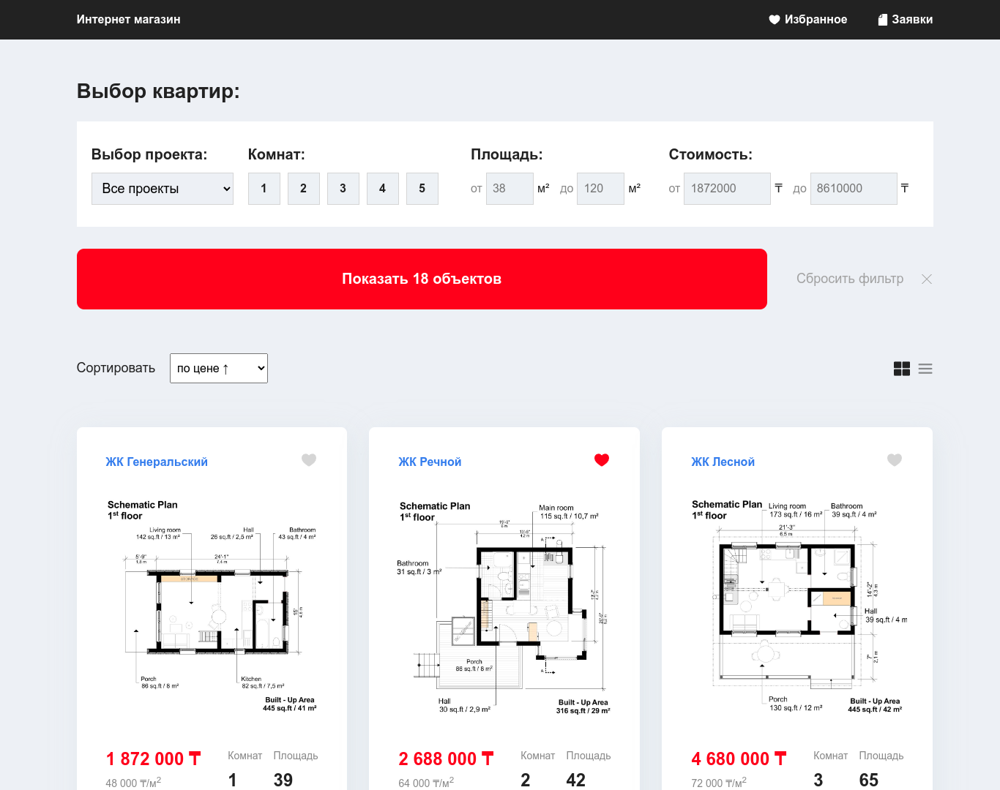

# Интернет магазин недвижимости

Реализация интернет магазина продажи квартир на нативном **JavaScript**.

## Предыстория проекта

Идея проекта, дизайн, а так же его **API** был взят из платного курса от [webcademy.ru](https://webcademy.ru/jscourse/). Привет Юрий, благодарю тебя за труды :)

Все остальное как концепция архитектуры кода, различных подходов (хранение состояния, роутинг и т.п.) и верстки макета была полностью мной переделана. Так же добавил от себя пагинацию, которая не фигурировала в общем дизайне.

## Функционал проекта

- Получение записей с сервера
- Фильтрация записей
- Сортировка записей
- Два режима отображение записей плиткой и таблицей
- Добавление записей в избранное
- Добавление заявок
- Отображение списка заявок
- Разбивка всего списка заявок пагинацией
